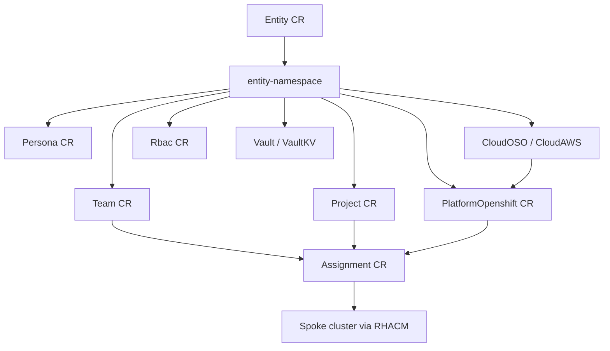
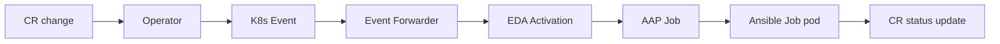
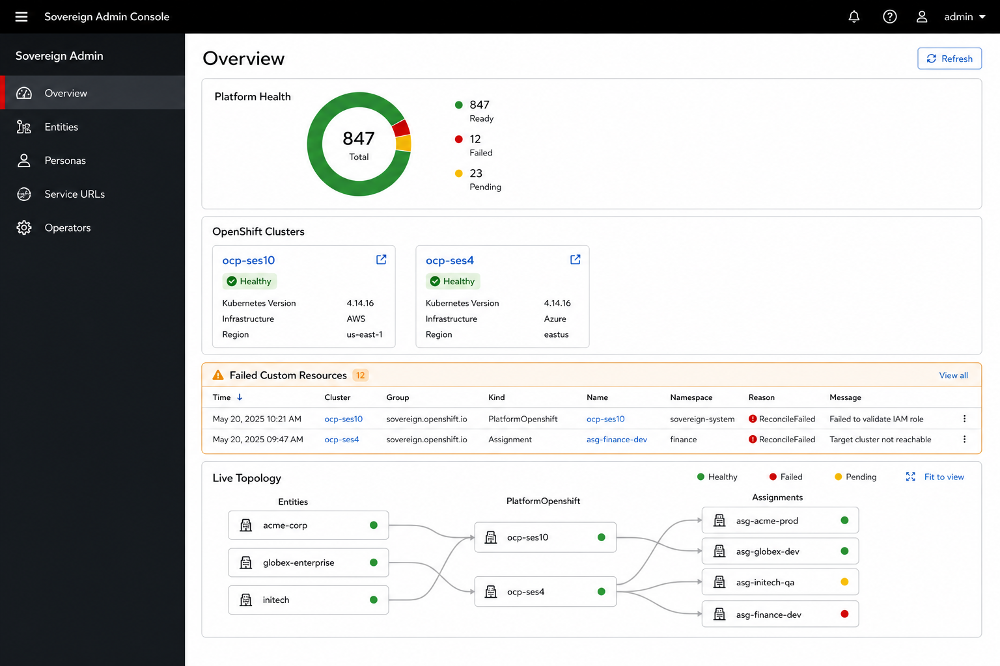
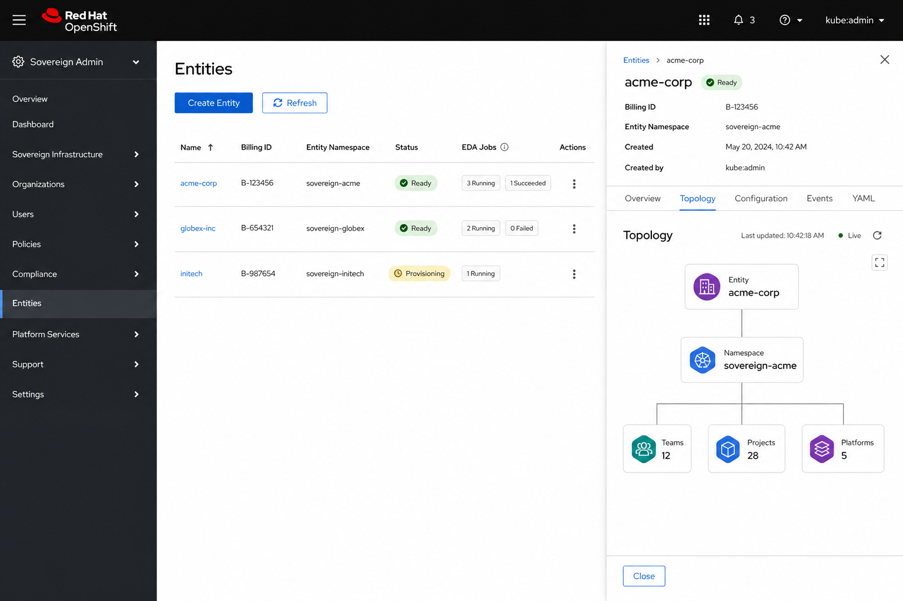
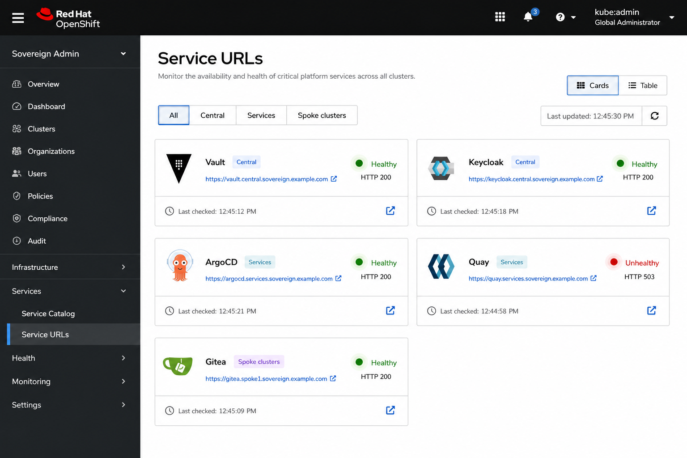
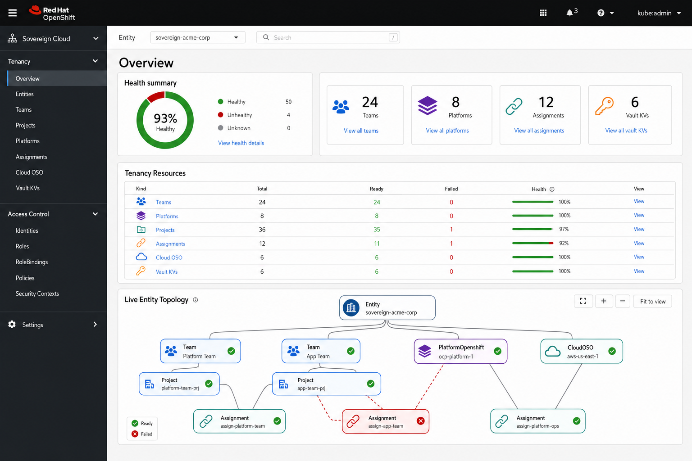
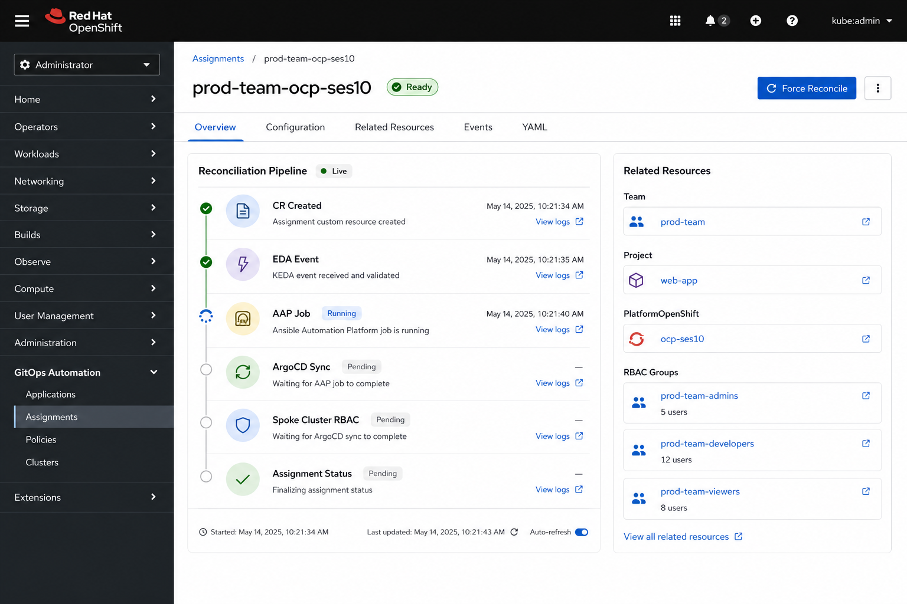
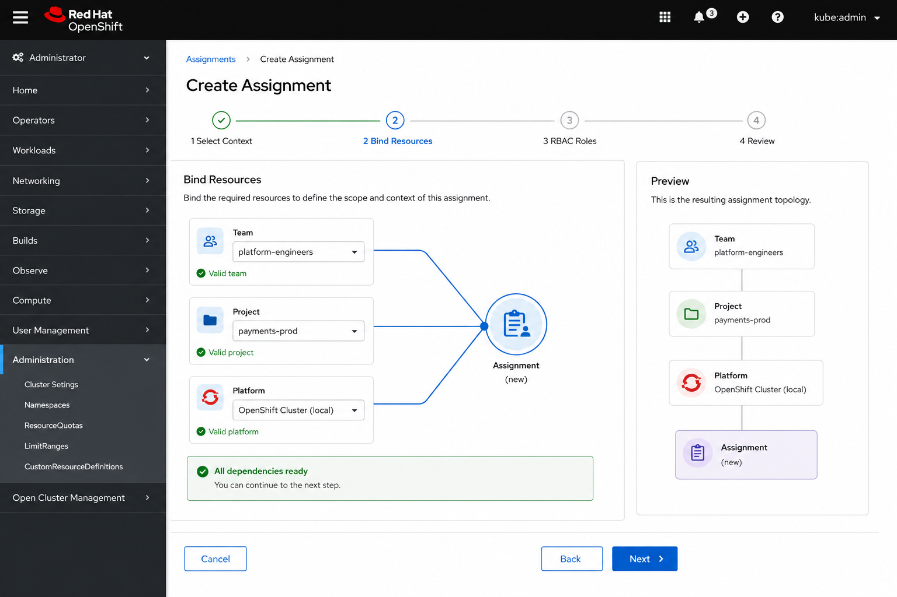
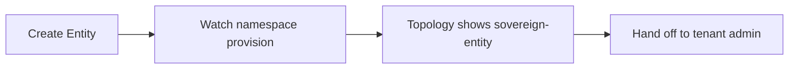
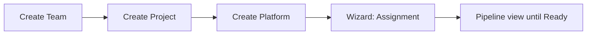

# Sovereign Cloud UI/UX Design — Existing Console Plugins

**Role:** Principal UI Architect  
**Scope:** `user_dashboard` (Global Admin) and `tenancy_dashboard` (Tenant Admin)  
**Target aesthetic:** OpenShift Console (PatternFly 5, admin perspective, native navigation)  
**Status:** Design proposal — no code changes  
**Date:** 2026-06-30

---

## 1. Executive Summary

Sovereign Cloud already ships two OpenShift Console dynamic plugins (`sovereign-admin-plugin`, `sovereign-tenant-plugin`) built on PatternFly 5 and `@openshift-console/dynamic-plugin-sdk`. The foundation is sound: console-native navigation, user OAuth token for all K8s calls, compact tables, status badges, and EDA job chips.

The primary UX gap is **cognitive load**. Operators manage a graph of interdependent custom resources (Entity → Team/Project/Platform → Assignment → spoke provisioning) but the UI presents mostly **flat tables**. The redesign keeps the OpenShift Console shell and elevates **live topology diagrams**, **reconciliation pipelines**, and **guided workflows** so the interface reflects the underlying implementation rather than hiding it behind YAML.

### Design North Stars

| Principle | Meaning |
|-----------|---------|
| **Console-native** | Feel like an OCP admin page: breadcrumbs, list/detail, tabs, status popovers, no custom chrome |
| **Implementation-visible** | CR dependency graph, EDA/AAP pipeline, and ArgoCD sync state are first-class UI elements |
| **Scope-aware** | Global admin = cluster-wide, no namespace filter. Tenant admin = entity namespace as primary context |
| **Actionable health** | Every red/yellow indicator links to root cause, logs, or the next remediation step |
| **Progressive disclosure** | Overview → list → detail → YAML; experts can go deep, novices stay guided |

---

## 2. Current State Assessment

### 2.1 Technology baseline (both plugins)

| Layer | Current |
|-------|---------|
| Framework | React + PatternFly 5 |
| Integration | OCP dynamic plugin (`console-extensions.json`, `consoleFetch`) |
| Auth | User bearer token via console proxy (no pod SA for user actions) |
| Styling | `main.css` with PF CSS variables — dark mode compatible |
| Shared patterns | `PageHeader`, `StatusBadge`, `EdaJobsChips`, `ForceReconcileButton`, `ResourceDetail` tabs |

### 2.2 Global Admin (`user_dashboard`) — today

**Navigation section:** Sovereign Admin  
**Routes:** Overview, Entities, Personas, Service URLs, Operators

| Page | Strengths | Gaps |
|------|-----------|------|
| **Overview** | Donut chart, cluster tiles, alerts table, per-kind health | No topology view; alerts lack deep links; scroll-heavy single column |
| **Entities** | List + inline detail via `ResourceDetail`; create form | No entity-scoped topology; delete uses `window.confirm` |
| **Personas** | List pattern | Read-only feel; weak link to Entity/Persona RBAC story |
| **Service URLs** | Multi-cluster routes + live HTTP health | Card/table toggle missing; no cluster topology context |
| **Operators** | CSV grouping by category | No link from degraded operator → affected CRs |

### 2.3 Tenant Admin (`tenancy_dashboard`) — today

**Navigation section:** Sovereign Cloud (Tenancy + Access Control separators)  
**Routes:** 14 resource types + create/edit flows

| Page | Strengths | Gaps |
|------|-----------|------|
| **Overview** | Namespace picker, kind stats, OIDC cluster cards | Topology absent; Entity entry point is namespace dropdown only |
| **Resource lists** | Reusable `ResourceList`: auto-refresh, stat bar, detail drawer | 14 similar pages — no unified “my stack” view |
| **Create forms** | Dependency dropdowns (e.g. Assignment pulls Team/Project/Platform) | Flat forms; no wizard; no live validation against CR readiness |
| **Resource detail** | Overview / Configuration / Conditions / YAML tabs | No Related Resources tab; no pipeline diagram; no Events from K8s API |

### 2.4 Underlying implementation the UI must reflect

From the platform architecture, the operator-facing mental model is:



**Automation path** (what “EDA Jobs” chips represent):



The UI should make both graphs **live** — nodes colored from CR `status.ready`, edges from spec references, pipeline stages from `status.edaJobs` and conditions.

---

## 3. OpenShift Console Alignment Strategy

### 3.1 Visual language

Adopt OCP Console list/detail conventions explicitly:

| OCP pattern | Sovereign application |
|-------------|----------------------|
| **ListPage** layout | Title left, actions right, filter bar below title |
| **ResourceKebab** | Reconcile, Edit, Delete in overflow menu on detail pages |
| **StatusPopup** | Hover on StatusBadge → conditions + last transition |
| **Breadcrumbs** | Use console breadcrumb extension where possible; fallback to PF breadcrumb matching OCP spacing |
| **Label / LabelGroup** | Kind, cluster, entity labels — same compact style as OCP |
| **EmptyState** | Illustrated empty states with primary CTA (already started in `ResourceList`) |
| **Modal** | Delete confirmation (tenant plugin); extend to global admin |

### 3.2 Layout grid

```
┌─────────────────────────────────────────────────────────────────┐
│ OCP Global Header (existing)                                     │
├──────────┬──────────────────────────────────────────────────────┤
│ OCP Nav  │  [Namespace bar — tenant only]                        │
│          │  Breadcrumb > Resource name                           │
│ Sovereign│  ┌─────────────────────────────────────────────────┐ │
│ section  │  │ Page title          [Refresh] [Create] [⋮]      │ │
│          │  ├─────────────────────────────────────────────────┤ │
│          │  │ Filter / tabs                                     │ │
│          │  │ ┌──────────────────────┬──────────────────────┐  │ │
│          │  │ │ Primary content      │ Context panel (opt)  │  │ │
│          │  │ │ table | diagram      │ related resources    │  │ │
│          │  │ └──────────────────────┴──────────────────────┘  │ │
│          └──────────────────────────────────────────────────────┘ │
└─────────────────────────────────────────────────────────────────┘
```

- **Max content width:** keep `1400px` (current `.sc-page`) — matches OCP admin pages.
- **No custom sidebar** inside plugins — rely on OCP nav from `console-extensions.json`.
- **Dark mode:** continue using `--pf-v5-global--*` tokens only; avoid hardcoded grays.

### 3.3 Navigation IA improvements

**Global Admin** — add secondary structure without new top-level noise:

```
Sovereign Admin
├── Overview          ← platform health + topology summary
├── Entities          ← tenant onboarding
├── Personas          ← global persona templates / cross-entity view
├── ── Platform ──
├── Service URLs      ← route health
├── Operators         ← CSV health
```

**Tenant Admin** — reorder to match dependency flow (implementation order):

```
Sovereign Cloud
├── Entity Overview   ← rename route label from "Entity" to "Overview"
├── ── Tenancy ──
├── Teams
├── Projects
├── Platform Openshift
├── Cloud OSO
├── Cloud AWS
├── Migrate to OpenStack
├── Assignments       ← move after dependencies
├── Personas
├── ── Access Control ──
├── RBAC
├── Vaults
├── AAP Orgs
├── Quay Orgs
```

Add a **“Topology”** nav item under Tenancy (or Overview sub-tab) showing the live CR graph for the selected namespace.

---

## 4. Global Admin Design (`user_dashboard`)

**Audience:** Platform operators, sovereign-admin group  
**Context:** Cluster-wide visibility on services cluster (+ multi-cluster routes/operators)  
**No namespace picker** — correct for global scope

### 4.1 Overview — redesigned



**Layout (top → bottom):**

1. **Platform health strip** — donut + counts + last sync (keep existing, widen to full row)
2. **OpenShift cluster tiles** — keep; add ACM managed-cluster link and console deep link
3. **Live platform topology (NEW)** — mini force-directed or layered graph:
   - Layer 1: Entities
   - Layer 2: entity namespaces (aggregated count)
   - Layer 3: Assignments / Platforms (aggregated)
   - Click node → filtered list page
   - Node color = health ratio
4. **Alerts** — failed CRs with columns: Resource, Kind, Message, **Pipeline stage**, Actions
5. **Kind status tables** — keep Tenancy / Services sections; add row click → pre-filtered list

**Interactions:**

| Element | Data source | Behavior |
|---------|-------------|----------|
| Topology nodes | `listAllCRs()` grouped by kind/namespace | Poll 30s; pulse on status change |
| Pipeline stage | `status.edaJobs`, `status.conditions` | Tooltip with job name + link pattern |
| Cluster tile | `PlatformOpenshift.status` + ACM routes | External link to spoke console |

### 4.2 Entities — redesigned



**List view enhancements:**

- Replace inline detail toggle with **OCP-style row navigation** to `/sovereign-admin/entities/:name` (new route) OR keep slide-over but add **Topology tab**
- Columns: Name, Billing ID, Entity Namespace, **Ready**, EDA Jobs, Created, Actions
- Filter bar: text search, ready/failed/pending filter chips
- Delete → PatternFly Modal (match tenant plugin)

**Entity detail — new tabs:**

| Tab | Content |
|-----|---------|
| Overview | status fields, console URL, billing ID |
| **Topology (NEW)** | Live diagram: Entity → namespace → child CR counts by kind; click to open tenant plugin filtered view |
| Configuration | spec |
| Events / Conditions | existing |
| YAML | existing |

**Create Entity — wizard (lightweight):**

1. Identity (name, billing ID, description)
2. Review + create
3. Post-create banner: “Namespace provisioning started” with link to topology

### 4.3 Service URLs — redesigned



Enhance existing `ServicesPage`:

- **View toggle:** Cards (default for exec glance) / Table (operator dense)
- **Cluster tabs:** All | Central | Services | Spoke (from route metadata)
- **Health pulse:** green/red dot with last-checked relative time (existing batch health — surface more prominently)
- **Group by service type:** Keycloak, Vault, Quay, AAP, Gitea, ArgoCD (existing priority sort — add visual section headers)

### 4.4 Operators — redesigned

- KPI cards at top (already present) — add trend arrow if historical data added later
- Row click → side panel: CSV conditions, related CRDs, link to OCP OperatorHub instance
- **Degraded operator banner** on Overview when any CSV not ready

### 4.5 Personas — redesigned

- Cross-entity list with Entity column
- Link persona → RBAC role bindings (read-only from Persona status)
- Filter by entity namespace

---

## 5. Tenant Admin Design (`tenancy_dashboard`)

**Audience:** Entity admins, tenant operators  
**Context:** Selected entity namespace (`hybridsovereign.redhat/entity` label)  
**Primary control:** `NamespacePicker` (keep; enhance)

### 5.1 Namespace context bar — enhanced

Current `NamespacePicker` is functional. Improve:

```
┌─────────────────────────────────────────────────────────────────┐
│ Entity namespace  [ sovereign-acme-corp        ▼ ]  [Topology] │
│ Billing: ACME-001  ·  847 resources  ·  98% healthy             │
└─────────────────────────────────────────────────────────────────┘
```

- Show entity metadata from Entity CR (billing ID, description snippet)
- **Topology button** → full-page graph for current namespace
- Persist selection in `sessionStorage` (already likely via context — verify)

### 5.2 Overview — redesigned



**Sections:**

1. **Health summary** — donut + stat tiles (keep; align tile design with OCP dashboard cards)
2. **Live entity topology (NEW)** — full-width interactive diagram for selected namespace:
   - Nodes = CR instances (not just kinds)
   - Edges = spec references (team → assignment ← project)
   - Status halo: green/yellow/red from `status.ready`
   - Zoom/pan; click node → resource detail
3. **Issues panel** — keep; add **Reconcile** action per row
4. **Kind tables** — Tenancy / Access Control sections with View links (keep)

**Implementation note:** Build topology from a single `fetchAllForNamespace()` aggregator (same as Overview `KIND_CONFIG`) plus spec field mapping:

| Edge | From spec field |
|------|-----------------|
| Assignment → Team | `spec.team` |
| Assignment → Project | `spec.projects[]` |
| Assignment → Platform | `spec.openshift` |
| Assignment → RBAC | `spec.toolRbac.*` |
| Platform → Cloud | CloudOSO/AWS status refs |

### 5.3 Resource lists — unified pattern

Keep `ResourceList` as the single list engine. Add:

- **Column presets** per kind (already via `columns` prop)
- **Bulk reconcile** (select rows → Reconcile selected) for sovereign-admin
- **Quick filters** in toolbar: Ready | Failed | Pending
- **Row highlight** when resource appears in failed state on Overview

### 5.4 Resource detail — redesigned

Extend `ResourceDetail` tabs:

| Tab | Content |
|-----|---------|
| Overview | key status fields |
| Configuration | spec form-readonly grid |
| **Related Resources (NEW)** | Linked CRs as cards; unresolved refs in warning state |
| **Pipeline (NEW)** | Vertical stage diagram (see Assignment mockup) |
| Events / Conditions | merge K8s Events API + conditions |
| YAML | keep |



**Pipeline stages (generic template):**

1. **CR accepted** — `metadata.creationTimestamp`
2. **Operator observed** — Ready=False, reason=Reconciling
3. **EDA triggered** — from `status.edaJobs[]` (chip expand)
4. **AAP / Job completed** — job status from edaJobs
5. **Downstream ready** — e.g. `status.assignmentProvisioned`
6. **Ready=True** — condition timestamp

Each stage: icon, label, timestamp, optional “View logs” (link to AAP if URL in status).

### 5.5 Create flows — wizard pattern



Replace flat create forms for complex CRs with **PfWizard** (PatternFly Wizard):

| Resource | Steps |
|----------|-------|
| **Assignment** | 1 Context (namespace) → 2 Bind Team/Project/Platform (live diagram preview) → 3 RBAC roles → 4 Review |
| **PlatformOpenshift** | 1 Identity → 2 Cloud source (CloudOSO/AWS) → 3 OIDC → 4 Review |
| **Team / Project** | 1 Identity → 2 Review (simple) |

**Live validation during wizard:**

- Dropdown options gray out if referenced CR not Ready
- Preview panel shows resulting topology before submit
- Inline Alert if required dependency missing

### 5.6 Migrate to OpenStack — specialized UX

MTV migration is a multi-phase workflow. Dedicated design:

- **List:** migration plans with phase progress bar (Inventory → Copy → Cutover)
- **Create:** step wizard aligned with MTV CR fields (`mtvCatalog` utils already exist)
- **Detail:** pipeline diagram specific to MTV + OpenStack target from CloudOSO

---

## 6. Live Diagram System (shared component)

Proposed shared component: **`LiveTopologyDiagram`**

### 6.1 Requirements

| Requirement | Detail |
|-------------|--------|
| Data-driven | Nodes/edges from CR list + spec resolver map |
| Real-time | WebSocket optional; start with 30s poll + manual refresh |
| Accessible | List alternative view (“Accessibility view: table of relationships”) |
| Performant | Cap at ~50 nodes; aggregate beyond that (“12 Teams”) |
| Console styling | PF colors, no custom graph library theming |

### 6.2 Technology options

| Option | Pros | Cons |
|--------|------|------|
| **React Flow** | Pan/zoom, custom nodes, widely used | New dependency |
| **D3 force (light)** | Full control | More custom code |
| **Mermaid live render** | Simple | Not interactive enough |

**Recommendation:** React Flow with PF-styled node components — matches OCP Topology view feel (see Networking → Topology).

### 6.3 Node card design

```
┌─────────────────────┐
│ ● Team              │
│ prod-team           │
│ Ready               │
└─────────────────────┘
```

- Kind label (uppercase small)
- Name (truncated)
- Status badge
- Optional icon per kind (Team, Project, etc. from `@patternfly/react-icons`)

### 6.4 Pipeline diagram (detail tab)

Vertical **Stepper** component (PF Progress Stepper):

- Each step maps to condition or edaJob entry
- Failed step expands inline with message + Reconcile button
- Matches mockup in `design-tenant-assignment-pipeline.png`

---

## 7. Component Library Extensions

| Component | Purpose | Used in |
|-----------|---------|---------|
| `LiveTopologyDiagram` | CR relationship graph | Both overviews, Entity detail, Topology page |
| `ReconciliationPipeline` | Vertical automation stages | Resource detail |
| `RelatedResourcesPanel` | Spec/status cross-links | Resource detail |
| `StatusPopover` | Conditions on hover | All lists |
| `ResourceKebab` | OCP-standard actions menu | Detail headers |
| `CreateWizardShell` | PfWizard wrapper with namespace guard | Tenant creates |
| `ClusterHealthTile` | PlatformOpenshift card | Both overviews |
| `KindHealthTable` | Reusable kind stats table | Both overviews |
| `FilterToolbar` | Search + status chips | All lists |

### 7.1 EDA Jobs chips — enhance

Current `EdaJobsChips` is high-value. Extend:

- Click chip → popover with job name, status, start time
- Link to central AAP job template (if URL in CR status)
- Color: running=blue, success=green, failed=red

### 7.2 Force Reconcile — enhance

- Add confirmation for bulk reconcile
- Toast notification on success (OCP alert toast pattern)
- Disable while operator generation conflict likely

---

## 8. Page Mockup Gallery

| Mockup | Path | Description |
|--------|------|-------------|
| Global Overview | [design-assets/design-global-admin-overview.png](design-assets/design-global-admin-overview.png) | Health + clusters + live topology |
| Global Entities | [design-assets/design-global-admin-entities.png](design-assets/design-global-admin-entities.png) | List + detail topology tab |
| Global Service URLs | [design-assets/design-global-admin-services.png](design-assets/design-global-admin-services.png) | Route health cards by cluster |
| Tenant Overview | [design-assets/design-tenant-overview.png](design-assets/design-tenant-overview.png) | Namespace context + entity topology |
| Assignment Pipeline | [design-assets/design-tenant-assignment-pipeline.png](design-assets/design-tenant-assignment-pipeline.png) | Detail pipeline + related resources |
| Create Wizard | [design-assets/design-tenant-create-wizard.png](design-assets/design-tenant-create-wizard.png) | Assignment bind step with preview |

---

## 9. UX Flows

### 9.1 Onboard new tenant (global admin)



1. Global admin creates Entity on **Entities → Create**
2. Overview topology animates new node (pending → ready)
3. Entity detail shows namespace + link “Open in Tenant Admin” (deep link with namespace query param)

### 9.2 Provision assignment (tenant admin)



- Wizard validates all dependencies Ready before submit
- After create, redirect to Assignment detail Pipeline tab
- Overview topology highlights new edges

### 9.3 Diagnose failure (both)

1. Overview alerts / issues table → click row
2. Land on Resource detail → Pipeline tab shows failed stage
3. Related Resources tab shows broken ref (e.g. Platform not Ready)
4. Force Reconcile or fix upstream CR

---

## 10. Accessibility & Responsive

| Concern | Approach |
|---------|----------|
| Keyboard nav | All graph nodes have list-view alternative; wizard fully keyboard accessible |
| Screen readers | Topology described via `aria-label` on nodes; pipeline steps as ordered list |
| Color | Never rely on color alone — keep text labels on StatusBadge |
| Mobile | Console admin is desktop-first; tables horizontal scroll; topology collapses to list on `<768px` |

---

## 11. Implementation Roadmap

Phased delivery to limit risk:

### Phase 1 — Console polish (2–3 sprints)

- Modal delete on global admin
- StatusPopover on all lists
- Filter toolbar + search on Entities and ResourceList
- Namespace context bar metadata
- Related Resources tab (static links from spec)

### Phase 2 — Live diagrams (3–4 sprints)

- `LiveTopologyDiagram` on tenant Overview
- Mini topology on global Overview
- Entity detail topology tab
- React Flow integration + PF node styling

### Phase 3 — Pipelines & wizards (3–4 sprints)

- `ReconciliationPipeline` on detail pages
- Assignment + PlatformOpenshift create wizards
- Enhanced EDA job popovers
- MTV migration progress UI

### Phase 4 — Deep integration (ongoing)

- K8s Events tab (Events API)
- AAP job deep links from status
- ACM managed cluster links from Platform tiles
- Historical health trends (optional metrics backend)

---

## 12. Success Metrics

| Metric | Target |
|--------|--------|
| Time to diagnose failed Assignment | −40% (pipeline tab) |
| Create Assignment error rate | −30% (wizard validation) |
| Overview → root cause clicks | ≤3 clicks |
| Console plugin parity score | Match OCP list/detail patterns on 90% of pages |

---

## 13. What Not to Change

- **No standalone app chrome** — stay within OCP plugin model
- **No ServiceAccount API access** for user actions
- **No secrets in UI** — mask Vault paths; never display credentials
- **No deletion of sovereign-* namespaces** from UI
- **GitOps boundary** — UI manages CRs; does not `oc apply` platform config

---

## 14. References

| Document | Relevance |
|----------|-----------|
| [architecture/docs/12-console-plugins.md](../docs/12-console-plugins.md) | Plugin deployment and nav |
| [architecture/docs/technical/15-sovereign-dashboard.md](../docs/technical/15-sovereign-dashboard.md) | Global admin scope |
| [architecture/docs/technical/20-tenancy-dashboard.md](../docs/technical/20-tenancy-dashboard.md) | Tenant admin scope |
| [architecture/docs/concepts/10-component-interaction-map.md](../docs/concepts/10-component-interaction-map.md) | CR dependency graph |
| [architecture/docs/technical/006-eda-architecture.md](../docs/technical/006-eda-architecture.md) | Pipeline stages |
| `user_dashboard/plugin/console-extensions.json` | Current global nav |
| `tenancy_dashboard/plugin/console-extensions.json` | Current tenant nav |
| `tenancy_dashboard/plugin/src/components/ResourceList.tsx` | List pattern baseline |
| `user_dashboard/plugin/src/pages/OverviewPage.tsx` | Global overview baseline |

---

*This document describes intended UX improvements for the existing console plugins. Mockup images are in `design-assets/`.*
