# OpenStack Multi-VRF — Cloud Console UI Design (Option 2)

**Product name (UI):** **Sovereign OSO Networks**  
**Source networking spec:** [DESIGN.md](./DESIGN.md)  
**Contrast with:** [DESIGN_UI.md](./DESIGN_UI.md) (hybrid multi-cloud)  
**Console baseline:** [DESIGN_UI_Existing.md](./DESIGN_UI_Existing.md)  
**Audience:** Product, operator developers, console plugin engineers, Ansible/EDA authors  
**Status:** Design target — OpenStack-only, cloud-like console experience  
**Date:** 2026-06-30

---

## Table of contents

1. [Executive summary](#1-executive-summary)
2. [Cloud-like experience principles](#2-cloud-like-experience-principles)
3. [Product mental model](#3-product-mental-model)
4. [Scope: OpenStack-only vs hybrid](#4-scope-openstack-only-vs-hybrid)
5. [Architecture](#5-architecture)
6. [Operator CRs](#6-operator-crs)
7. [Automation contract](#7-automation-contract)
8. [Information architecture](#8-information-architecture)
9. [Design system and components](#9-design-system-and-components)
10. [Global admin UI — `user_dashboard`](#10-global-admin-ui--user_dashboard)
11. [Tenant admin UI — `tenancy_dashboard`](#11-tenant-admin-ui--tenancy_dashboard)
12. [Onboarding and guided setup](#12-onboarding-and-guided-setup)
13. [Dashboard interactions](#13-dashboard-interactions)
14. [Observability and operations UX](#14-observability-and-operations-ux)
15. [RBAC, security, and migration](#15-rbac-security-and-migration)
16. [Mockup gallery](#16-mockup-gallery)
17. [Phased delivery](#17-phased-delivery)
18. [Appendices](#18-appendices)

---

## 1. Executive summary

### 1.1 What we are building

**Sovereign OSO Networks** is a tenant-facing **network-as-a-service** layer on OpenStack. Tenants create isolated logical networks where **overlapping IP is safe** — the same way two AWS VPCs can both use `10.0.0.0/16` without collision because they are separate routing domains.

The platform owns **VNI / VRF / route-target** numbering. Tenants express intent (`OsoNetwork` + `OsoNetworkBinding`); automation maps that onto Neutron (`ovn-bgp-agent`) and the on-prem EVPN fabric (Nexus route-reflector pair).

**Option 2 scope:** OpenStack only. No AWS, no OpenShift networking, no cross-cloud tunnels.

### 1.2 Cloud-like experience goal

The UI should feel like a **managed cloud networking product** embedded in OpenShift Console — comparable to AWS VPC, Azure Virtual Network, or GCP VPC, but native to Sovereign Cloud:

| Cloud pattern | Sovereign OSO Networks equivalent |
|---------------|-----------------------------------|
| Service landing hub | **OSO Networks** home with metrics + quick actions |
| Resource list + detail | Networks, Bindings, Fabric, Peers |
| Create wizard | **Attach network to OpenStack** (4 steps) |
| Resource map / topology | Live EVPN binding graph |
| Health dashboard | **Network Health** with severity grouping |
| Capacity meter | **VNI Pool** utilization |
| Setup checklist | First-network onboarding modal |
| Copy resource ID | `networkId`, VNI, RT with clipboard |
| Activity / pipeline | Reconciliation pipeline + EDA job chips |

### 1.3 Design decisions (locked)

| Decision | Choice |
|----------|--------|
| Backend | **CloudOSO only** |
| CR kinds | **4 new** + existing `CloudOSO` |
| Numbering | Platform-owned VNI pool on `OsoFabric` |
| UI shell | OpenShift Console dynamic plugins (PatternFly 5) |
| Primary tenant verb | **Create network → Attach to OpenStack** |
| Primary platform verb | **Enable fabric → Register EVPN peer** |
| Decommission | `spec.state: absent` on binding |

### 1.4 Mockups (generated reference)

| Screen | Image |
|--------|-------|
| Tenant — OSO Networks hub | 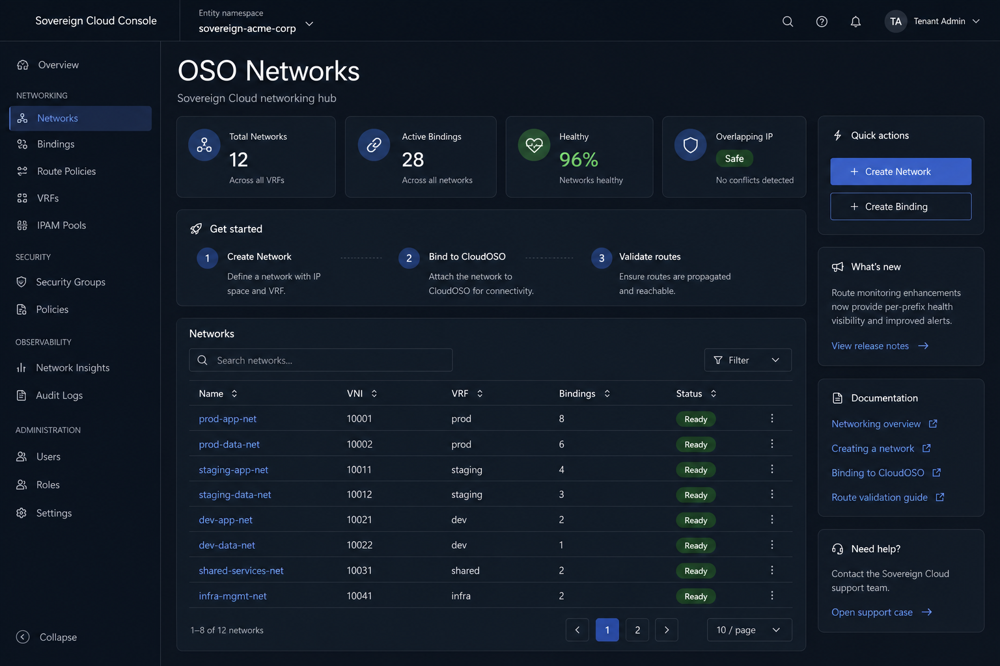 |
| Tenant — Network detail + topology | 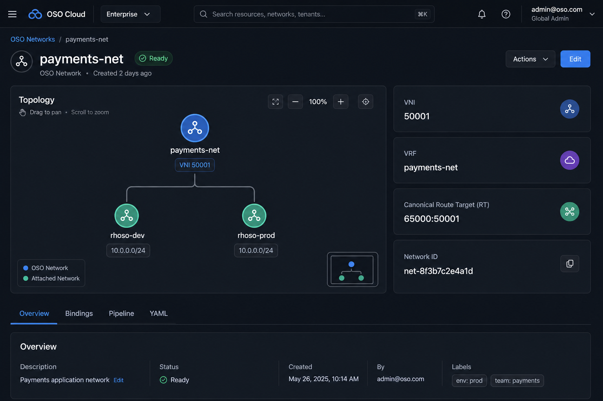 |
| Tenant — Attach wizard (prefixes) | 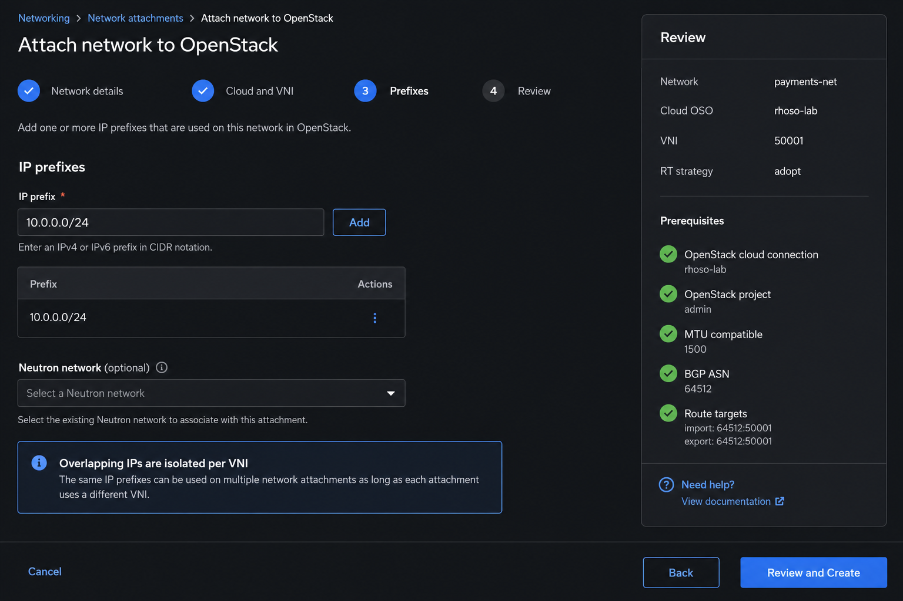 |
| Tenant — CloudOSO attachments | 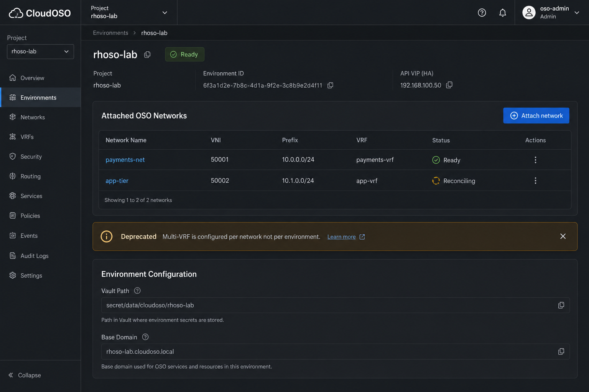 |
| Tenant — Onboarding checklist | 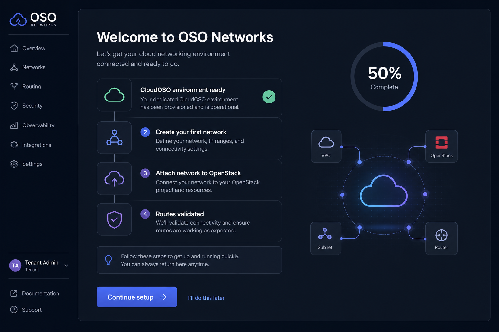 |
| Admin — Networking control plane | 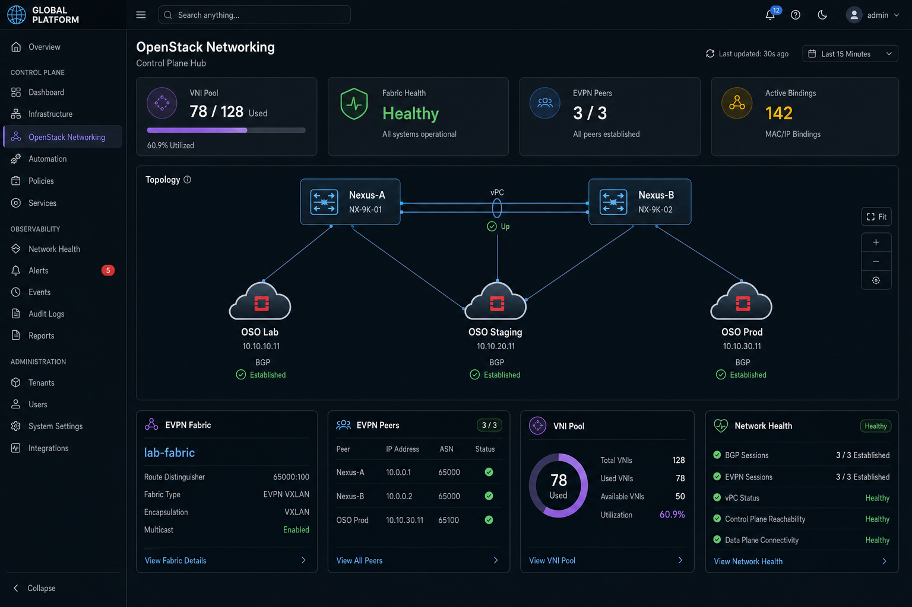 |
| Admin — Network Health | 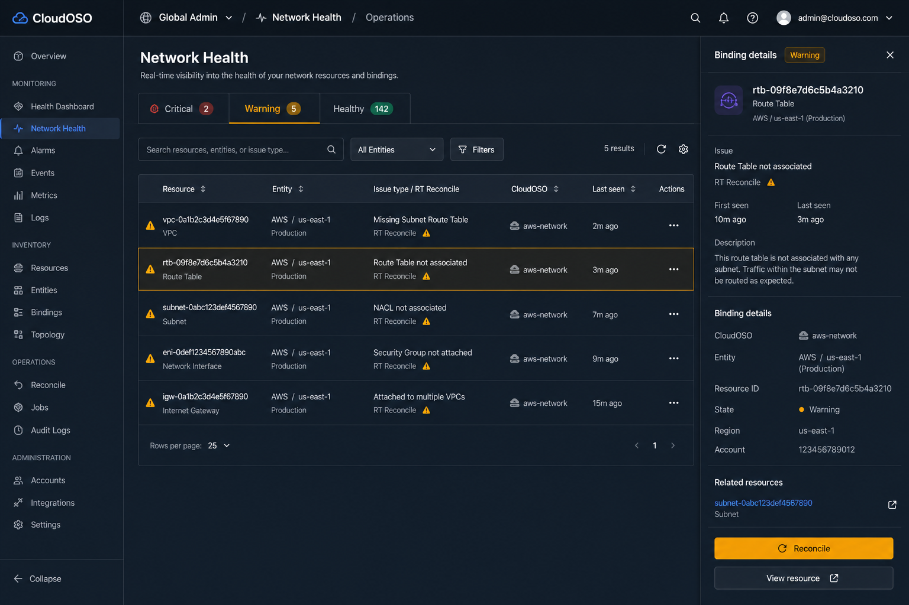 |
| Admin — VNI Pool capacity | 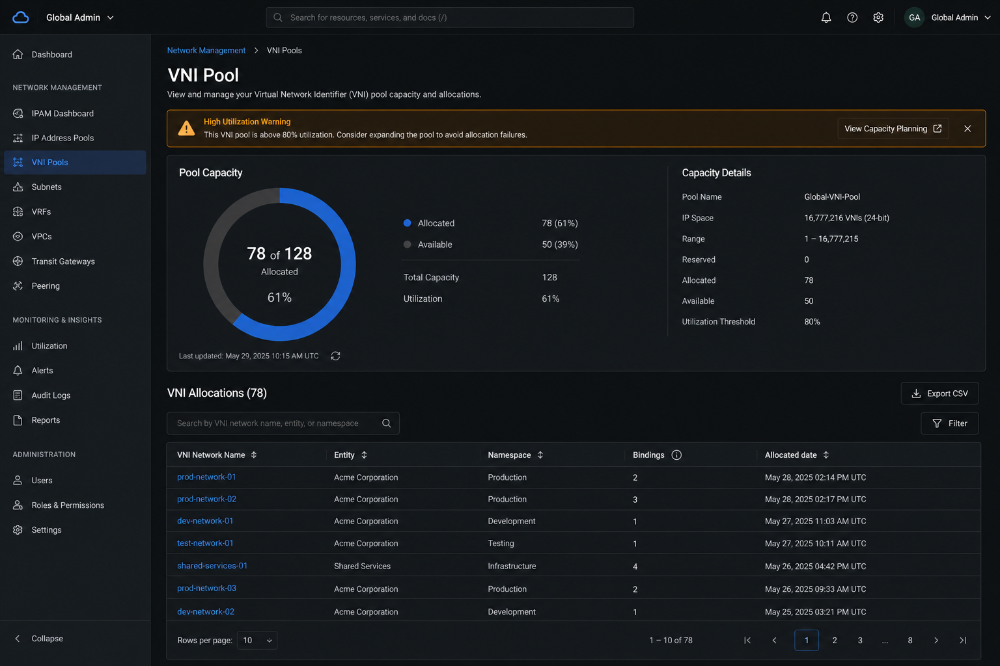 |

---

## 2. Cloud-like experience principles

### 2.1 North stars

| Principle | Implementation |
|-----------|----------------|
| **Service-first navigation** | Users land on a **hub page** per service, not a raw CR list |
| **Intent over infrastructure** | Tenant says "attach `10.0.0.0/24` to `rhoso-lab`"; UI hides VNI allocation until review |
| **Progressive disclosure** | Simple create (name + description) → detail reveals numbering + topology |
| **Always show health** | Every list row has status; every detail has pipeline position |
| **Actionable failures** | Red/yellow states link to root cause, reconcile, or admin prerequisite |
| **Console-native** | PatternFly 5, OCP breadcrumbs, no custom app chrome |
| **GitOps parity** | Every form has YAML tab + import template producing identical spec |

### 2.2 UX anti-patterns to avoid

| Avoid | Instead |
|-------|---------|
| Exposing VNI picker to tenants | Read-only cards after allocation |
| `enableVRF` per CloudOSO | Per-network bindings |
| Flat CR tables without context | Hub metrics + topology + quick actions |
| Generic "Error" toasts | Condition-type-specific alerts with remediation |
| Blocking wizard with jargon | Plain language: "Attach network to OpenStack" |

### 2.3 Language map (user-facing vs internal)

| User-facing (UI) | Internal (CR / API) |
|------------------|---------------------|
| OSO Network | `OsoNetwork` |
| Attachment / Binding | `OsoNetworkBinding` |
| OpenStack environment | `CloudOSO` |
| EVPN Fabric | `OsoFabric` |
| EVPN Peer | `OsoEvpnPeer` |
| Route target | `canonicalRt` / `backendRt` |
| Isolation ID | VNI (shown, not editable) |

### 2.4 Page archetypes

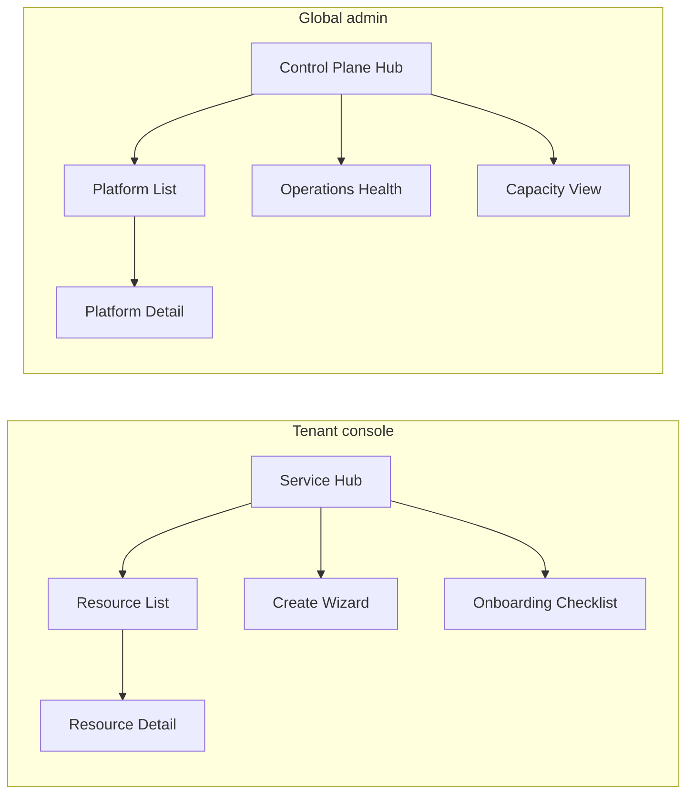

---

## 3. Product mental model

### 3.1 One-sentence pitch

> **Create a network identity once, attach it to any of your OpenStack environments with the IP ranges you need — overlapping addresses stay isolated automatically.**

### 3.2 Tenant object hierarchy

```
Entity namespace (sovereign-acme-corp)
├── CloudOSO environments        ← "Where" (OpenStack projects)
│   ├── rhoso-dev
│   ├── rhoso-stg
│   └── rhoso-prd
├── OSO Networks                 ← "What" (isolated routing domain)
│   ├── payments-net  (VNI 50001)
│   └── app-tier      (VNI 50002)
└── Attachments (Bindings)       ← "How" (prefixes per environment)
    ├── payments-net → rhoso-dev  (10.0.0.0/24)
    └── payments-net → rhoso-prd  (10.0.0.0/24)  ← same IP, safe
```

### 3.3 Platform object hierarchy

```
sovereign-cloud namespace
├── OsoFabric (lab-fabric)       ← VNI pool + Nexus RR
└── OsoEvpnPeer (per OSO cloud)  ← BGP speakers for ovn-bgp-agent
```

### 3.4 Physical topology (diagram legend for all UI graphs)

```
  ON-PREM  AS 65000
  ┌────────────────────────────────────────────────────────────┐
  │     Nexus-A ═══ vPC ═══ Nexus-B   (VTEP + Route Reflector) │
  │          ▲              ▲              ▲                    │
  │          │ eBGP EVPN   │ eBGP EVPN    │ eBGP EVPN          │
  │     ┌────┴────┐   ┌────┴────┐   ┌────┴────┐               │
  │     │ OSO dev │   │ OSO stg │   │ OSO prd │               │
  │     │ovn-bgp  │   │ovn-bgp  │   │ovn-bgp  │               │
  │     └────┬────┘   └────┬────┘   └────┬────┘               │
  │     Neutron nets per tenant VRF/VNI                        │
  └────────────────────────────────────────────────────────────┘
```

---

## 4. Scope: OpenStack-only vs hybrid

| Area | Hybrid ([DESIGN_UI.md](./DESIGN_UI.md)) | Option 2 |
|------|----------------------------------------|----------|
| Backends | AWS, OpenStack, OpenShift | **CloudOSO only** |
| Platform CRs | Fabric, Gateway, Transport | **Fabric, EVPN Peer** |
| Tenant CRs | HybridNetwork, NetworkPlacement | **OsoNetwork, OsoNetworkBinding** |
| Cross-site transport | WireGuard / IPsec / MACsec | **None** |
| Placement wizard | Backend kind radio | **CloudOSO picker only** |
| Admin pages | + Gateways, Transport | **Networking hub, Peers, VNI Pool, Health** |
| RT strategy | native / adopt / rewrite | **Mostly adopt** (ovn-bgp-agent) |

---

## 5. Architecture

### 5.1 Three-tier mapping

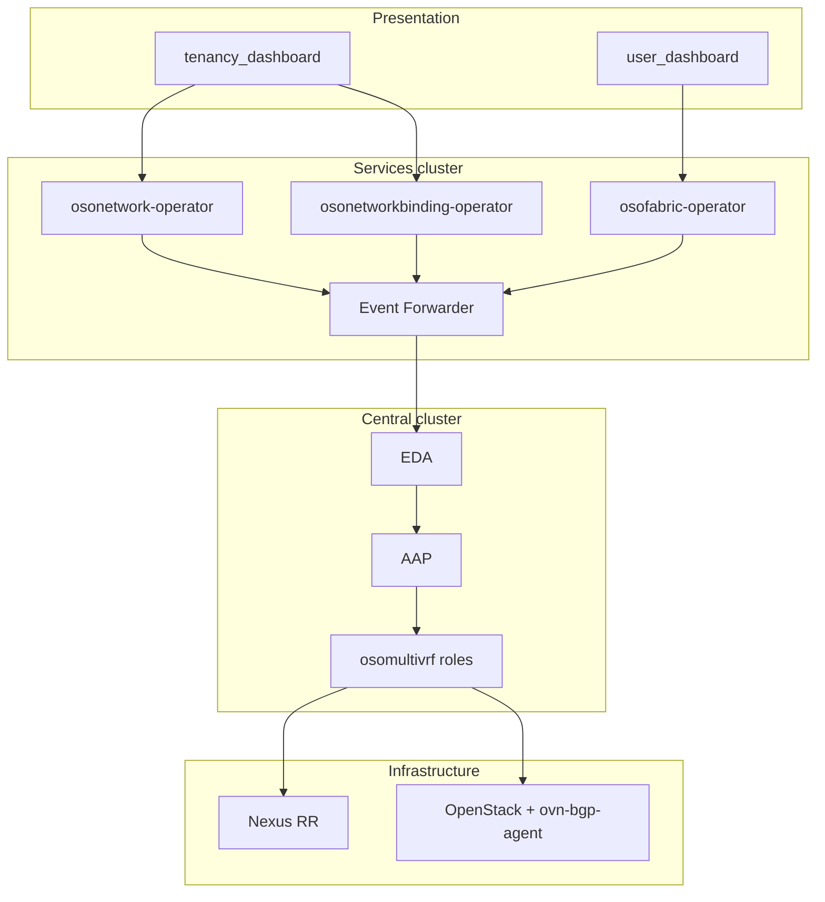

### 5.2 CR dependency graph

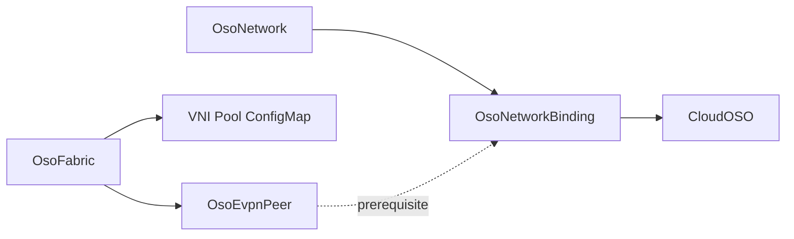

---

## 6. Operator CRs

All CRs: `apiVersion: hybridsovereign.redhat/v1alpha1`, namespaced, standard Sovereign status (`ready`, `status`, `message`, `edaJobs[]`, `conditions[]`, `observedGeneration`, `lastReconciledAt`).

### 6.1 `OsoFabric` (platform)

| | |
|---|---|
| **Plural** | `osofabrics` |
| **Namespace** | `sovereign-cloud` only |
| **Purpose** | Day-0 EVPN fabric, VNI pool, Nexus RR config |

**Spec fields (UI form):**

| Field | Type | UI control |
|-------|------|------------|
| `enabled` | boolean | Toggle with disable confirmation |
| `domainAsn` | integer | Number input |
| `routeReflectors[]` | name + IPv4 | Editable table |
| `vniPool.start/end` | integer | Range with utilization preview |
| `vaultCredentialRef` | string | Vault path (never value) |
| `numberingAuthority.rtFormat` | string | Advanced accordion |
| `numberingAuthority.vrfNameFormat` | string | Advanced accordion |

**Status (UI cards):**

| Field | Display |
|-------|---------|
| `fabricBaseReady` | Fabric health tile |
| `allocatedVniCount` / `availableVniCount` | Progress bar |
| `ready` | StatusBadge |

### 6.2 `OsoEvpnPeer` (platform)

| | |
|---|---|
| **Plural** | `osoevpnpeers` |
| **Namespace** | `sovereign-cloud` |
| **Purpose** | Register OpenStack deployment BGP endpoints |

**Spec fields:**

| Field | UI control |
|-------|------------|
| `fabricRef` | Dropdown of ready fabrics |
| `cloudLabel` | Text (display name) |
| `domainAsn` | Number |
| `bgpPeers[]` | Table editor |
| `cloudOSOSelector` | Label selector builder |
| `enabled` | Toggle |

**Status:**

| Field | Display |
|-------|---------|
| `bgpSessionUp` | Per-peer session indicator |
| `peerCount` | `N/M sessions up` |
| `resolvedCloudOSOCount` | Linked environments count |
| `ready` | StatusBadge |

### 6.3 `OsoNetwork` (tenant)

| | |
|---|---|
| **Plural** | `osonetworks` |
| **Namespace** | `sovereign-*` |
| **Purpose** | Logical isolated network identity |

**Spec:** `description`, optional `networkViewerRbac[]`  
**Status (read-only in UI):** `networkId`, `vni`, `vrfName`, `canonicalRt`, `fabric`, `bindingCount`, `bindingsReady`, `allocated`, `fabricVniReady`

> Tenants never set VNI, VRF, RT, or prefixes in spec.

### 6.4 `OsoNetworkBinding` (tenant)

| | |
|---|---|
| **Plural** | `osonetworkbindings` |
| **Namespace** | `sovereign-*` |
| **Purpose** | Attach network to CloudOSO with CIDRs |

**Spec:**

| Field | Required | UI |
|-------|----------|-----|
| `network` | yes | Dropdown |
| `cloudOSO` | yes | Dropdown with readiness badge |
| `prefixes[]` | when present | CIDR list builder |
| `neutronNetwork` | no | Optional text / auto-create |
| `state` | yes | `present` default; `absent` for decommission |

**Status:** `vni`, `vrfName`, `canonicalRt`, `backendRt`, `rtStrategy`, `evpnPeerRef`, `prerequisiteReady`, `fabricApplied`, `backendApplied`, `validated`, `realizedPrefixes[]`, `neutronNetworkId`

### 6.5 `CloudOSO` (existing — UI evolution)

**Deprecate:** `spec.enableVRF`, `spec.vrfId`  
**Add status:** `evpnCapable`, `evpnPeerRef`, `attachedNetworkCount`

### 6.6 Operator packaging

| Operator | Watches | EDA |
|----------|---------|-----|
| `OsoFabric/` | `OsoFabric`, `OsoEvpnPeer` | `osomultivrf` |
| `OsoNetwork/` | `OsoNetwork` | `osomultivrf` |
| `OsoNetworkBinding/` | `OsoNetworkBinding` | `osomultivrf` |

---

## 7. Automation contract

### 7.1 Binding provision chain

```
OsoNetworkBinding (state=present)
  → allocate
  → guard_prerequisites  (OsoFabric + OsoEvpnPeer + CloudOSO ready)
  → fabric_vni           (Nexus VRF/VNI + RT adopt)
  → backend_openstack    (Neutron + ovn-bgp-agent)
  → validate             (gates ready)
```

### 7.2 Roles not used in Option 2

`cloud_landing_zone`, `transport`, `backend_aws`, `backend_openshift`, cross-cloud `border_bgw`

### 7.3 Pipeline stages (UI mapping)

| Stage | Condition / status | User message |
|-------|-------------------|--------------|
| 1. Accepted | CR created | "Request received" |
| 2. Allocated | `Allocated=True` | "Isolation ID assigned" |
| 3. Prerequisites | `prerequisiteReady` | "Fabric and OpenStack ready" |
| 4. Fabric VNI | `fabricApplied` | "EVPN fabric configured" |
| 5. OpenStack | `backendApplied` | "Neutron routes advertised" |
| 6. Validated | `validated=true` | "Connectivity confirmed" |
| 7. Ready | `ready=true` | Green badge |

### 7.4 Decommission flow

1. User clicks **Detach from OpenStack** (not "Delete" first)
2. Confirm modal: *"Withdraw routes from rhoso-lab only. Other attachments unchanged."*
3. PATCH `spec.state: absent`
4. Pipeline runs reverse; UI shows **Withdrawing** state
5. After `validated` confirms withdrawal → optional CR delete

---

## 8. Information architecture

### 8.1 Tenant navigation (`tenancy_dashboard`)

```
Sovereign Cloud
├── Overview                          (extend: OSO Networks tile + mini topology)
├── ── Tenancy ──
├── Teams … Assignments
├── Cloud OSO                         (existing)
├── OSO Networks          ★ NEW HUB   /sovereign-tenant/oso-networks
│   ├── [list]
│   ├── create
│   └── :name/detail
├── Attachments           ★ NEW       /sovereign-tenant/oso-bindings
│   ├── [list]
│   ├── create (wizard)
│   └── :name/detail
├── … Access Control …
```

**Label rationale:** "Attachments" in nav is shorter than "OSO Network Bindings"; page title uses full name.

### 8.2 Global admin navigation (`user_dashboard`)

```
Sovereign Admin
├── Overview                          (extend: networking KPI strip)
├── Entities … Operators
├── ── OpenStack Networking ──  ★ NEW
├── Networking              HUB     /sovereign-admin/openstack-networking
├── EVPN Fabric                     /sovereign-admin/openstack-networking/fabric
├── EVPN Peers                      /sovereign-admin/openstack-networking/peers
├── VNI Pool                        /sovereign-admin/openstack-networking/vni-pool
├── Network Health                  /sovereign-admin/openstack-networking/health
```

**Hub vs list:** `/openstack-networking` is the **control plane dashboard** (mockup: admin hub). Sub-routes are focused lists/details.

### 8.3 Route table

| Route | Page component | Type |
|-------|----------------|------|
| `/sovereign-tenant/oso-networks` | `OsoNetworkHubPage` | Hub |
| `/sovereign-tenant/oso-networks/create` | `OsoNetworkCreatePage` | Form |
| `/sovereign-tenant/oso-networks/detail` | `OsoNetworkDetailPage` | Detail |
| `/sovereign-tenant/oso-bindings` | `OsoBindingListPage` | List |
| `/sovereign-tenant/oso-bindings/create` | `OsoBindingWizardPage` | Wizard |
| `/sovereign-tenant/oso-bindings/detail` | `OsoBindingDetailPage` | Detail |
| `/sovereign-admin/openstack-networking` | `OsoNetworkingHubPage` | Hub |
| `/sovereign-admin/openstack-networking/fabric` | `OsoFabricPage` | Detail |
| `/sovereign-admin/openstack-networking/peers` | `OsoEvpnPeerListPage` | List |
| `/sovereign-admin/openstack-networking/vni-pool` | `OsoVniPoolPage` | Capacity |
| `/sovereign-admin/openstack-networking/health` | `OsoNetworkHealthPage` | Operations |

---

## 9. Design system and components

### 9.1 Existing components (reuse)

| Component | Use |
|-----------|-----|
| `PageHeader` | All pages |
| `StatusBadge` / `StatusPopover` | Lists + detail |
| `FilterToolbar` | Search + status chips |
| `LiveTopologyDiagram` | Hub + detail hero |
| `ReconciliationPipeline` | Detail pipeline tab |
| `RelatedResourcesPanel` | Binding detail |
| `EdaJobsChips` | All reconciling resources |
| `ForceReconcileButton` | Detail header |
| `ListPagination` | Large lists |

### 9.2 New components (cloud patterns)

| Component | Purpose | Pages |
|-----------|---------|-------|
| `ServiceHubMetrics` | 4-up KPI cards (count, %, trend) | Both hubs |
| `GettingStartedCard` | Numbered setup steps with completion | Tenant hub |
| `OnboardingChecklistModal` | First-visit guided setup | Tenant hub |
| `QuickActionsPanel` | Sticky right-rail CTAs | Tenant hub |
| `NumberingCardGrid` | VNI / VRF / RT with copy-to-clipboard | Network detail |
| `CapacityMeter` | VNI pool progress + warning thresholds | Admin hub, VNI pool |
| `SeverityTabs` | Critical / Warning / Healthy grouping | Network Health |
| `AttachmentTable` | Compact bindings on CloudOSO / Network | Detail pages |
| `PrerequisiteBanner` | Links to admin peer when blocked | Wizard |
| `RtReconcileAlert` | Plain-language RT adopt explanation | Binding detail |
| `ResourcePreviewDrawer` | Side panel on health table row | Network Health |
| `CidrListInput` | Add/remove/validate prefixes | Wizard |
| `CloudOSOPicker` | Dropdown with ready + evpnCapable badges | Wizard |
| `CopyIdButton` | One-click copy `networkId`, VNI | Detail cards |
| `EmptyStateIllustrated` | SVG + primary CTA | Zero-network state |

### 9.3 `ServiceHubMetrics` spec

```tsx
// Example props
metrics={[
  { label: 'Networks', value: 12, href: '/oso-networks' },
  { label: 'Attachments', value: 28, href: '/oso-bindings' },
  { label: 'Healthy', value: '96%', variant: 'success', tooltip: 'Bindings validated' },
  { label: 'Isolation', value: 'VNI pool', variant: 'info', tooltip: 'Overlapping IP safe' },
]}
```

### 9.4 Visual tokens (extend `main.css`)

| Token / class | Use |
|---------------|-----|
| `.sc-hub-metrics` | 4-column grid, equal height cards |
| `.sc-numbering-card` | Monospace value, copy icon, label above |
| `.sc-capacity-meter` | PF Progress bar + warning at 80%, critical at 95% |
| `.sc-severity-tab` | Badge count on tab label |
| `.sc-topology-hero` | Min-height 360px, bordered card |
| `.sc-wizard-review` | Sticky right 320px panel |
| `.sc-quick-actions` | Right rail, stacks on `<1200px` |

### 9.5 Microcopy guidelines

| Context | Copy |
|---------|------|
| Empty networks | "No networks yet. Create an OSO Network to isolate overlapping IP ranges across your OpenStack environments." |
| Create CTA | "Create network" (not "Create OsoNetwork") |
| Attach CTA | "Attach to OpenStack" (not "Create binding") |
| Overlap info | "Other tenants may use the same IP range. Your traffic stays isolated by VNI {vni}." |
| RT adopt | "OpenStack uses route target {backendRt}. The platform is adding it to the fabric. No action needed." |
| Decommission | "Detach from {cloudOSO}" (not "Delete binding" as first action) |
| Pool warning | "VNI pool is {pct}% full. Contact your platform administrator to expand capacity." |

---

## 10. Global admin UI — `user_dashboard`

**Audience:** Platform operators (`sovereign-admin`)  
**Scope:** Cluster-wide, no namespace picker

### 10.1 Networking control plane hub


**Route:** `/sovereign-admin/openstack-networking`

| Zone | Content |
|------|---------|
| **Metrics strip** | VNI pool % · Fabric status · Peers up/total · Active bindings (all tenants) |
| **Hero topology** | Nexus vPC ↔ peer nodes per OSO deployment; click → peer detail |
| **Service cards** | 4 cards: EVPN Fabric, EVPN Peers, VNI Pool, Network Health |
| **Recent activity** | Last 10 binding state changes (ready/failed) across entities |
| **Alerts** | Inline banner if any peer down or pool >80% |

**Interactions:**

- Click topology node → filtered list (peers or bindings)
- Card "View all" → sub-route
- Auto-refresh 30s; manual refresh in header

### 10.2 EVPN Fabric page

**Route:** `/sovereign-admin/openstack-networking/fabric`

| Section | Content |
|---------|---------|
| Header | Fabric name, Ready badge, Edit / YAML / Reconcile |
| Capacity | `CapacityMeter` tied to `vniPool` |
| Configuration | Read-only grid: ASN, RRs, vault ref |
| Topology (embedded) | Nexus pair only, peers collapsed |
| Conditions + EDA | Existing patterns |

**Edit form:** Same fields as §6.1; disable toggle shows impact modal listing active VNIs.

### 10.3 EVPN Peers list + detail

**List columns:** Name · Cloud label · Domain ASN · Sessions · Linked CloudOSOs · Ready · Age

**Create wizard (3 steps):**

1. **Identity** — name, fabric, cloud label, ASN  
2. **BGP peers** — ovn-bgp-agent loopbacks table  
3. **Mapping + review** — CloudOSO label selector, YAML preview  

**Detail tabs:** Overview · BGP Sessions · Linked CloudOSOs · Pipeline · YAML

**BGP Sessions table:**

| Peer | Address | State | Last event | Uptime |
|------|---------|-------|------------|--------|

### 10.4 VNI Pool capacity page


| Feature | Detail |
|---------|--------|
| Donut chart | Allocated vs available |
| Warning banner | At 80% and 95% thresholds |
| Table | VNI, network, entity, namespace, bindings, allocated at |
| Export | CSV for capacity planning |
| Row click | Deep link to tenant network (if RBAC allows) |

### 10.5 Network Health operations page


| Feature | Detail |
|---------|--------|
| `SeverityTabs` | Critical · Warning · Healthy |
| Filters | Entity, CloudOSO, issue type, text search |
| Table | Resource, kind, entity, issue, RT strategy, last validated |
| Preview drawer | Binding/network summary + Reconcile + Open in tenant console |
| Bulk reconcile | Select rows → Reconcile selected (admin only) |

**Issue types:**

| Type | Severity | Default action |
|------|----------|----------------|
| Validation failed | Critical | Open binding pipeline |
| EVPN peer down | Critical | Open peer detail |
| RT reconcile pending >10m | Warning | Show RtReconcileAlert |
| Prerequisites missing | Warning | Link to peer/fabric |
| Pool exhausted | Critical | Link to fabric edit |

### 10.6 Overview integration

Add KPI strip to global Overview:

```
OpenStack Networking   142 bindings · 96% healthy · VNI 78/128   [View hub →]
```

---

## 11. Tenant admin UI — `tenancy_dashboard`

**Audience:** Entity admins  
**Scope:** Selected namespace via `NamespacePicker`

### 11.1 Enhanced namespace context bar

```
┌────────────────────────────────────────────────────────────────────────────┐
│ Entity  [ sovereign-acme-corp ▼ ]   Billing ACME-001 · 12 networks · 96%  │
│                                                    [Setup guide] [Topology] │
└────────────────────────────────────────────────────────────────────────────┘
```

- **Setup guide** → opens `OnboardingChecklistModal` if incomplete  
- **Topology** → full-page entity graph with network nodes highlighted  

### 11.2 OSO Networks service hub


**Route:** `/sovereign-tenant/oso-networks`

| Zone | Content |
|------|---------|
| Metrics | Networks, Attachments, Healthy %, Overlapping-IP-safe badge |
| Getting started | 3-step card (hide when all complete) |
| Quick actions (right) | Create network · Attach to OpenStack |
| Main table | Searchable, filterable network list |
| Empty state | Illustrated CTA when zero networks |

**Table columns:** Name · VNI · VRF · Attachments · Status · Created · ⋮

**Row actions:** View · Attach to OpenStack · Reconcile · YAML

**Row click:** → detail page

### 11.3 Create network (lightweight form)

**Route:** `/sovereign-tenant/oso-networks/create`

| Field | Validation |
|-------|------------|
| Name | DNS-1123 subdomain |
| Description | Optional, max 512 chars |

**Post-create:** Redirect to detail + toast: *"Network created. Platform is assigning isolation ID."* + CTA **Attach to OpenStack**

### 11.4 Network detail page


**Route:** `/sovereign-tenant/oso-networks/detail?name=&namespace=`

| Zone | Content |
|------|---------|
| Header | Name, description, Ready badge, Reconcile, ⋮ menu |
| Hero split | Topology (left 60%) · Numbering cards (right 40%) |
| Tabs | Overview · Attachments · Pipeline · Conditions · YAML |

**Numbering cards (copy-enabled):**

| Card | Value |
|------|-------|
| VNI | `50001` |
| VRF | `payments-net` |
| Canonical RT | `65000:50001` |
| Network ID | `net-a1b2c3d4…` |

**⋮ menu:** Attach to OpenStack · Reconcile · Edit description · Delete (blocked if attachments exist)

### 11.5 Attachments list page

**Route:** `/sovereign-tenant/oso-bindings`

| Column | Source |
|--------|--------|
| Name | `metadata.name` |
| Network | `spec.network` (link) |
| OpenStack env | `spec.cloudOSO` (link) |
| Prefixes | `spec.prefixes` |
| Validated | icon |
| Status | StatusBadge |

**Filters:** Network, CloudOSO, Ready, Validated

### 11.6 Attach to OpenStack wizard


**Route:** `/sovereign-tenant/oso-bindings/create`

**Title:** "Attach network to OpenStack" (user-facing; not "Create OsoNetworkBinding")

| Step | Title | Fields |
|------|-------|--------|
| 1 | Select network | Dropdown; show VNI if allocated |
| 2 | Select environment | `CloudOSOPicker`; gray out not-ready |
| 3 | IP prefixes | `CidrListInput` + optional Neutron network |
| 4 | Review and create | Summary + YAML preview |

**Sticky review panel (steps 2–4):** Numbering + prerequisites (see §7.3)

**Validation gates:**

- Network must have `status.networkId` (or show "Allocating…" spinner)
- CloudOSO `status.ready` and `status.evpnCapable`
- `OsoEvpnPeer` for deployment must be ready
- At least one valid CIDR

**Success:** Redirect to binding detail Pipeline tab; toast *"Attaching network to rhoso-lab…"*

### 11.7 Attachment detail page

**Tabs:** Overview · Pipeline · Related resources · Conditions · YAML

| Overview section | Content |
|------------------|---------|
| Summary | Network + CloudOSO links, prefixes, RT strategy |
| Realized state | `realizedPrefixes`, `neutronNetworkId` |
| Actions | Edit prefixes · Detach from OpenStack · Reconcile |

**Detach flow:** See §7.4

### 11.8 CloudOSO integration


On `CloudOSOEditPage` and future CloudOSO detail:

1. **Remove** `enableVRF` / `vrfId` fields  
2. **Add** `AttachmentTable` card  
3. **Add** info banner with link to OSO Networks hub  
4. **Add** EVPN status line: `evpnCapable`, `evpnPeerRef`  

**Attach network** button → wizard with `?cloudOSO={name}&namespace={ns}`

### 11.9 Overview integration

Extend tenant Overview:

- Add OSO Networks + Attachments to `KIND_CONFIG`
- Topology includes network nodes and binding edges
- Issues panel surfaces failed bindings with Reconcile

---

## 12. Onboarding and guided setup


### 12.1 When to show

| Trigger | UI |
|---------|-----|
| First visit to OSO Networks hub | `OnboardingChecklistModal` |
| CloudOSO exists but zero networks | Inline `GettingStartedCard` on hub |
| Network exists but zero attachments | Banner on network detail |
| Entity just created | Handoff banner on global Entity detail |

### 12.2 Checklist steps

| # | Step | Completion rule |
|---|------|-----------------|
| 1 | OpenStack environment ready | Any `CloudOSO.status.ready` |
| 2 | Create your first network | Any `OsoNetwork` exists |
| 3 | Attach network to OpenStack | Any `OsoNetworkBinding` exists |
| 4 | Routes validated | Any binding `status.validated=true` |

**Progress ring:** % of steps complete  
**Primary CTA:** "Continue setup" → next incomplete step deep link

### 12.3 Platform admin onboarding (first fabric)

| Step | Page |
|------|------|
| 1 | Enable `OsoFabric` |
| 2 | Create `OsoEvpnPeer` per OSO deployment |
| 3 | Verify Network Health all green |

Show on admin Networking hub when `OsoFabric` not ready.

---

## 13. Dashboard interactions

### 13.1 Responsibility matrix

| Action | user_dashboard | tenancy_dashboard |
|--------|:--------------:|:-----------------:|
| Enable fabric / peers | ✓ | ✗ |
| Create network | ✗ | ✓ |
| Attach to OpenStack | ✗ | ✓ |
| View VNI pool / cross-tenant health | ✓ | ✗ |
| View entity networks | read-only | ✓ |
| Force reconcile | ✓ | ✓ |
| YAML import templates | fabric, peer | network, binding |

### 13.2 Journey: first overlapping network

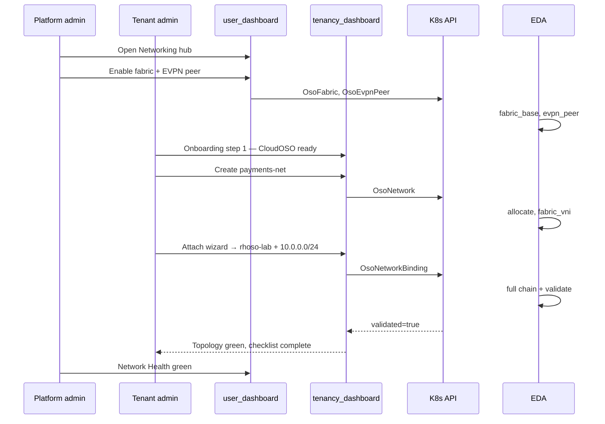

### 13.3 Journey: multi-environment same IP

1. `payments-net` attached to `rhoso-dev` with `10.0.0.0/24` — validated  
2. User clicks **Attach to OpenStack** on network detail  
3. Wizard step 2 selects `rhoso-prod`; step 3 enters same `10.0.0.0/24`  
4. Review panel shows same VNI `50001` — info callout explains isolation  
5. Topology shows two attachment nodes under one network  
6. Admin VNI Pool shows one VNI, two bindings  

### 13.4 Deep links

| From | To | URL |
|------|-----|-----|
| Health row | Attachment detail | `/sovereign-tenant/oso-bindings/detail?ns={ns}&name={name}` |
| Prerequisite banner | EVPN peer | `/sovereign-admin/openstack-networking/peers` |
| CloudOSO card | Attach wizard | `/sovereign-tenant/oso-bindings/create?cloudOSO={name}&namespace={ns}` |
| VNI pool row | Network detail | `/sovereign-tenant/oso-networks/detail?...` |
| Entity detail (global) | Tenant hub | Tenancy plugin `?namespace={entityNs}` |
| Network detail | CloudOSO | `/sovereign-tenant/cloudoso/edit?...` |

---

## 14. Observability and operations UX

### 14.1 Signals → UI

| Signal | Source | UI surface |
|--------|--------|------------|
| Binding ready ratio | CR list | Hub metrics `% Healthy` |
| VNI utilization | `OsoFabric.status` | Capacity meter |
| RT reconcile pending | conditions | Health tab + RtReconcileAlert |
| BGP session state | `OsoEvpnPeer` | Peer detail + hub topology |
| EDA job | `status.edaJobs` | EdaJobsChips |
| Last validated | `lastValidatedAt` | Attachment detail |

### 14.2 Condition → component map

| Condition | Component |
|-----------|-----------|
| `Allocated` | Green check on numbering card |
| `Prerequisite` | `PrerequisiteBanner` |
| `FabricVNI` | Pipeline step |
| `Backend` | Pipeline step |
| `RTReconcile` | `RtReconcileAlert` |
| `Validated` | StatusBadge + timestamp |
| `PoolExhausted` | Hub banner + block create |

### 14.3 State machine (attachment)

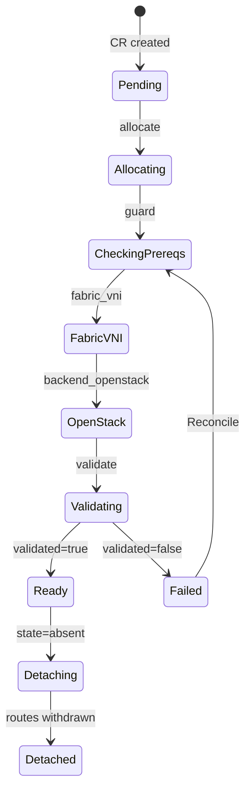

---

## 15. RBAC, security, and migration

### 15.1 Namespace RBAC keys

| Key | Resources | Persona |
|-----|-----------|---------|
| `osoNetworkAdmin` | `osonetworks` | Entity network admin |
| `osoNetworkView` | `osonetworks` (get/list/watch) | Viewer |
| `osoNetworkBindingAdmin` | `osonetworkbindings` | Same |
| `osoNetworkBindingView` | `osonetworkbindings` | Viewer |
| `osoFabricAdmin` | `osofabrics`, `osoevpnpeers` | Platform only |

### 15.2 Console `accessReview` (nav)

```json
{
  "type": "console.navigation/href",
  "properties": {
    "id": "sovereign-oso-networks",
    "name": "OSO Networks",
    "href": "/sovereign-tenant/oso-networks",
    "section": "sovereign-cloud-section",
    "perspective": "admin",
    "accessReview": [
      { "group": "hybridsovereign.redhat", "resource": "osonetworks", "verb": "list" }
    ]
  }
}
```

### 15.3 Security rules

- No secrets in CR spec or UI — Vault paths only  
- All API via user OAuth token  
- CIDR validation client + server side  
- Never delete `sovereign-*` namespaces from UI  

### 15.4 `enableVRF` migration

| Phase | UI | Backend |
|-------|-----|---------|
| 1 | Hide checkbox; show attachments card + banner | Ignore `enableVRF` on reconcile |
| 2 | Remove from edit form entirely | Status-only probe |
| 3 | CRD deprecation | Remove fields v1beta1 |

### 15.5 YAML templates

| Template | Dashboard | Kind |
|----------|-----------|------|
| OSO Network (empty) | tenancy | `OsoNetwork` |
| Attach to OpenStack | tenancy | `OsoNetworkBinding` |
| OsoFabric (lab) | admin | `OsoFabric` |
| OsoEvpnPeer (lab) | admin | `OsoEvpnPeer` |

---

## 16. Mockup gallery

All mockups: [`option2-mockups/`](./option2-mockups/)

| # | File | Screen | Primary components |
|---|------|--------|-------------------|
| 1 | `option2-tenant-networks-hub.png` | Tenant service hub | ServiceHubMetrics, GettingStartedCard, QuickActionsPanel |
| 2 | `option2-tenant-network-detail.png` | Network detail | LiveTopologyDiagram, NumberingCardGrid, AttachmentTable |
| 3 | `option2-tenant-binding-wizard.png` | Attach wizard step 3 | CidrListInput, wizard review panel |
| 4 | `option2-tenant-cloudoso-attachments.png` | CloudOSO detail | AttachmentTable, deprecation banner |
| 5 | `option2-tenant-onboarding.png` | Setup checklist | OnboardingChecklistModal |
| 6 | `option2-admin-networking-hub.png` | Admin control plane | CapacityMeter, hero topology, service cards |
| 7 | `option2-admin-network-health.png` | Operations health | SeverityTabs, ResourcePreviewDrawer |
| 8 | `option2-admin-vni-pool.png` | Capacity planning | Donut chart, export table |

### 16.1 Implementation fidelity checklist

When building each screen, verify:

- [ ] Dark mode uses `--pf-v5-global--*` tokens only  
- [ ] Hub pages load metrics + table in parallel  
- [ ] Topology caps at 50 nodes; aggregate beyond  
- [ ] Copy buttons on `networkId`, VNI, RT  
- [ ] Wizard blocks with `PrerequisiteBanner`, not silent fail  
- [ ] Health page drawer works keyboard-only (Esc to close)  
- [ ] Empty states have primary CTA  
- [ ] All tables have search + status filter chips  

---

## 17. Phased delivery

| Phase | Backend | UI deliverable |
|-------|---------|----------------|
| **1** | CRDs + emitters; allocate + fabric_vni | Networks hub (list), create, detail numbering cards, YAML templates |
| **2** | Binding + backend_openstack + validate | Attach wizard, attachment list/detail, pipeline tab |
| **3** | OsoFabric + OsoEvpnPeer day-0 | Admin networking hub, fabric + peers pages |
| **4** | RT adopt hardening | RtReconcileAlert, Network Health, VNI pool |
| **5** | Remove enableVRF | Onboarding checklist, CloudOSO attachments card, overview topology |

**Sprint 1 quick wins (no new CRs):** CloudOSO attachments card mock behind feature flag; hub page shell with placeholder metrics.

---

## 18. Appendices

### Appendix A — CR quick reference

| Kind | Creator | Namespace | Purpose |
|------|---------|-----------|---------|
| `OsoFabric` | Platform admin | `sovereign-cloud` | EVPN fabric + VNI pool |
| `OsoEvpnPeer` | Platform admin | `sovereign-cloud` | OSO BGP registration |
| `OsoNetwork` | Tenant admin | `sovereign-*` | Logical network identity |
| `OsoNetworkBinding` | Tenant admin | `sovereign-*` | Attach network → CloudOSO |
| `CloudOSO` | Tenant admin | `sovereign-*` | OpenStack environment |

### Appendix B — Form ↔ API (tenant)

| UI label | API field |
|----------|-----------|
| Network name | `OsoNetwork.metadata.name` |
| Description | `OsoNetwork.spec.description` |
| Network | `OsoNetworkBinding.spec.network` |
| OpenStack environment | `OsoNetworkBinding.spec.cloudOSO` |
| IP prefixes | `OsoNetworkBinding.spec.prefixes[]` |
| Neutron network | `OsoNetworkBinding.spec.neutronNetwork` |
| Detach | `OsoNetworkBinding.spec.state: absent` |

### Appendix C — Sample CRs

```yaml
# OsoNetwork
apiVersion: hybridsovereign.redhat/v1alpha1
kind: OsoNetwork
metadata:
  name: payments-net
  namespace: sovereign-acme-corp
spec:
  description: Isolated payments tier
---
# OsoNetworkBinding
apiVersion: hybridsovereign.redhat/v1alpha1
kind: OsoNetworkBinding
metadata:
  name: payments-in-lab
  namespace: sovereign-acme-corp
spec:
  network: payments-net
  cloudOSO: rhoso-lab
  prefixes: [10.0.0.0/24]
  state: present
```

### Appendix D — Related documentation

- [DESIGN.md](./DESIGN.md) — EVPN networking primer  
- [DESIGN_UI.md](./DESIGN_UI.md) — Hybrid multi-cloud UI (superset)  
- [DESIGN_UI_Existing.md](./DESIGN_UI_Existing.md) — Console plugin baseline  
- [architecture/docs/technical/15-sovereign-dashboard.md](../docs/technical/15-sovereign-dashboard.md)  
- [architecture/docs/technical/20-tenancy-dashboard.md](../docs/technical/20-tenancy-dashboard.md)  

### Appendix E — `console-extensions.json` fragment (tenant)

```json
{
  "type": "console.navigation/separator",
  "properties": {
    "id": "sovereign-oso-networking-sep",
    "section": "sovereign-cloud-section",
    "name": "OSO Networks",
    "perspective": "admin"
  }
},
{
  "type": "console.navigation/href",
  "properties": {
    "id": "sovereign-oso-networks",
    "name": "OSO Networks",
    "href": "/sovereign-tenant/oso-networks",
    "section": "sovereign-cloud-section",
    "perspective": "admin"
  }
},
{
  "type": "console.page/route",
  "properties": {
    "path": "/sovereign-tenant/oso-networks",
    "component": { "$codeRef": "OsoNetworkHubPage.default" },
    "perspective": "admin"
  }
}
```

---

*Option 2 delivers a **cloud product experience** inside OpenShift Console: service hubs, guided onboarding, capacity planning, and operations health — scoped to OpenStack multi-VRF only. Mockups in [`option2-mockups/`](./option2-mockups/) are illustrative targets; implementation must use PatternFly 5 and existing Sovereign plugin patterns.*
