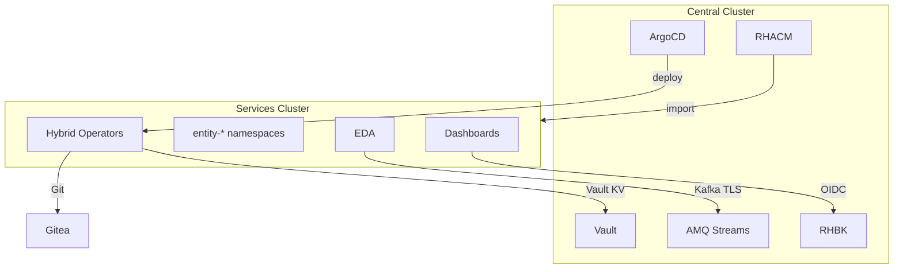

# Cluster Connectivity Tests

**Scope**: Network and API connectivity between central cluster, services cluster, and platform dependencies  
**Prerequisites**: Mega-Phase A (foundation) complete; RHACM imported services cluster

---

## Cluster Contexts

| Context | API Server (example) | Role |
|---------|---------------------|------|
| `central-admin` | `api.central.lab.example.com` | Bootstrap, Vault, RHBK, ACM, CNV, MTV |
| `services-admin` | `api.shc-services.lab.example.com` | Tenant operators, entity namespaces, dashboards |

Set contexts via `oc config` or inventory in test runner.

---

## Test Cases

### TC-CONN-001: Central API Reachability

```bash
oc whoami --context=central-admin
oc get nodes --context=central-admin
```

**Expected**: Authenticated; all nodes Ready

### TC-CONN-002: Services API Reachability

```bash
oc whoami --context=services-admin
oc get nodes --context=services-admin
```

**Expected**: Authenticated; all nodes Ready

### TC-CONN-003: RHACM Managed Cluster Import

```bash
oc get managedcluster --context=central-admin
oc get managedcluster <services-cluster-name> -o jsonpath='{.status.conditions[?(@.type=="ManagedClusterImportComplete")].status}'
```

**Expected**: `True`; cluster shows Available

### TC-CONN-004: ArgoCD → Services Cluster Deploy

```bash
oc get application -n openshift-gitops --context=central-admin | grep services
```

**Expected**: Services-targeted Applications `Synced` / `Healthy`

### TC-CONN-005: Vault API (Central)

```bash
# From sovereign-cloud-jobs pod or port-forward — do not print token
oc exec -n sovereign-cloud deploy/vault --context=central-admin -- vault status
```

**Expected**: Sealed=false; HA peers healthy

### TC-CONN-006: Vault Kubernetes Auth (Services)

```bash
# Ansible Job using vault_k8s_auth succeeds
oc get job -n sovereign-cloud-jobs --context=services-admin | grep vault-k8s-auth
```

**Expected**: Job Completed

### TC-CONN-007: Keycloak / RHBK OIDC

```bash
curl -sk -o /dev/null -w "%{http_code}" https://<rhbk-host>/realms/master/.well-known/openid-configuration
```

**Expected**: HTTP 200

### TC-CONN-008: Quay Registry Pull

```bash
# From any platform pod
oc run pull-test --image=quay.example.com/hybrid-sovereign/namespace-operator:<tag> --restart=Never --context=services-admin
oc get pod pull-test -o jsonpath='{.status.phase}'
```

**Expected**: Succeeded (or Running then delete)

### TC-CONN-009: Gitea Git (IAAC)

```bash
curl -sk -o /dev/null -w "%{http_code}" https://<gitea-host>/api/v1/version
```

**Expected**: HTTP 200

### TC-CONN-010: Kafka Bootstrap (AMQ Streams)

```bash
oc get kafka hybridsovereign-kafka -n amq-streams --context=central-admin -o jsonpath='{.status.conditions[?(@.type=="Ready")].status}'
```

**Expected**: `True`

### TC-CONN-011: Kafka Client from Event Forwarder

```bash
oc logs -l app.kubernetes.io/name=event-forwarder -n sovereign-cloud-jobs --context=central-admin --tail=50
```

**Expected**: No connection refused; no auth errors

### TC-CONN-012: DNS Forwarder / Lab Ingress

```bash
# Resolve public lab hostname
dig +short <lab-ingress-host>
```

**Expected**: Resolves to the correct lab ingress hostname (public DNS A record)

### TC-CONN-013: EDA → AAP Connectivity

```bash
oc get edaactivation -n aap-eda --context=services-admin
```

**Expected**: Activations `Running`; rulebooks reach AAP API

### TC-CONN-014: ACM Policy → Services Cluster

```bash
oc get policy -n sovereign-cloud --context=central-admin
```

**Expected**: Policies propagate; `PolicyReport` shows compliance on services

### TC-CONN-015: Central → Services API via ServiceAccount

```bash
# Assignment operator central SA token resolves via Vault
# Run resolve_central_cluster_connection.yml task in dry-run Job
```

**Expected**: Services API reachable with scoped token

---

## Network Path Diagram



---

## Pass Criteria

- TC-CONN-001 through TC-CONN-015 PASS (skip TC-CONN-010/011 if Mega-Phase D not complete)
- No TLS certificate errors in platform pod logs
- Cross-cluster latency < 500ms for API calls (informational)

## Failure Triage

| Symptom | Likely Cause | Check |
|---------|--------------|-------|
| ManagedCluster not Available | Import secret expired | ArgoCD cluster secret, RHACM |
| Vault connection refused | Pod not ready / sealed | `oc get pods -n sovereign-cloud` |
| Kafka auth failure | ExternalSecret not synced | `oc get externalsecret -n sovereign-cloud-jobs` |
| Quay pull ImagePullBackOff | Missing pull secret | `oc get secret -n sovereign-cloud` |
